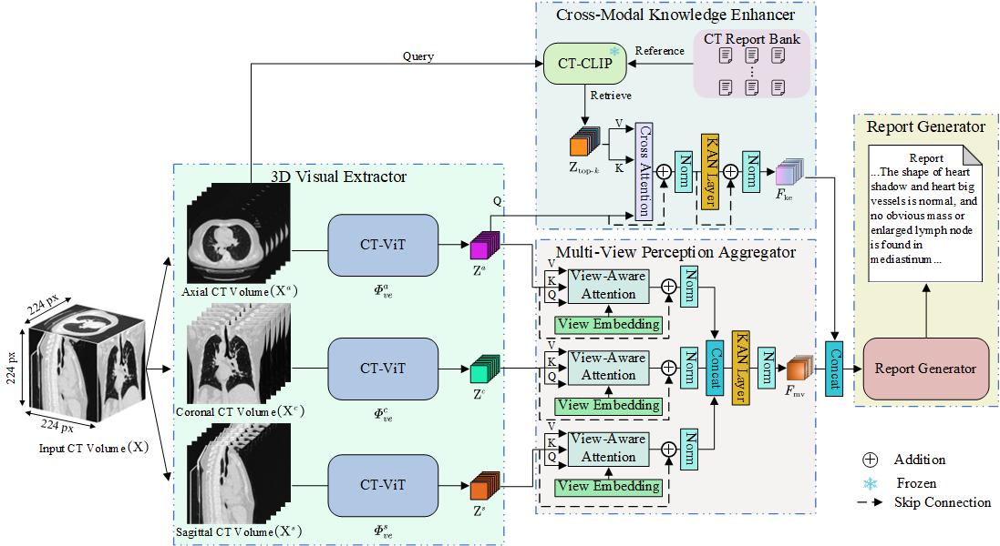

# MvKeTR
[IJBHI 2025] This is the official implementation of [MvKeTR: Chest CT Report Generation with Multi-View Perception and Knowledge Enhancement](https://ieeexplore.ieee.org/document/11045098) accepted to IEEE Journal of Biomedical and Health Informatics (J-BHI), 2025.

## Abstract

CT report generation (CTRG) aims to automatically generate diagnostic reports for 3D volumes, relieving clinicians' workload and improving patient care. Despite clinical value, existing works fail to effectively incorporate diagnostic information from multiple anatomical views and lack related clinical expertise essential for accurate and reliable diagnosis. To resolve these limitations, we propose a novel Multi-view perception Knowledge-enhanced TansfoRmer (MvKeTR) to mimic the diagnostic workflow of clinicians. Just as radiologists first examine CT scans from multiple planes, a Multi-View Perception Aggregator (MVPA) with view-aware attention is proposed to synthesize diagnostic information from multiple anatomical views effectively. Then, inspired by how radiologists further refer to relevant clinical records to guide diagnostic decision-making, a Cross-Modal Knowledge Enhancer (CMKE) is devised to retrieve the most similar reports based on the query volume to incorporate domain knowledge into the diagnosis procedure. Furthermore, instead of traditional MLPs, we employ Kolmogorov-Arnold Networks (KANs) as the fundamental building blocks of both modules, which exhibit superior parameter efficiency and reduced spectral bias to better capture high-frequency components critical for CT interpretation while mitigating overfitting. Extensive experiments on the public CTRG-Chest-548 K dataset demonstrate that our method outpaces prior state-of-the-art (SOTA) models across almost all metrics.



## Requirements

+ torch==2.0.1
+ torchvision==0.15.2
+ numpy==1.22.4

## Model

You can download the model checkpoint from [here](https://drive.google.com/file/d/1j50O5X_pF8JngJZ8YEbC3lUMfsdJPhGg/view?usp=sharing).

## Dataset

The CTRG-Chest-548K dataset used in this work can be downloaded from [here](https://pan.baidu.com/s/1z_0lam0Y3w8pzWC0x6mmsA?pwd=cu6a). Moreover, you need to download `clip_report_embeddings.npz` from [here](https://drive.google.com/file/d/1F0FSE95LP2xusl8v35H2-ingH3yhSB3c/view?usp=sharing), the extracted report embeddings of the [CTRG-Chest-548K dataset](https://github.com/tangyuhao2016/CTRG) via [ CT-RATE](https://huggingface.co/datasets/ibrahimhamamci/CT-RATE) pretrained [CT-CLIP](https://github.com/ibrahimethemhamamci/CT-CLIP).
Please place the extracted files and `clip_report_embeddings.npz` in the `data` folder. 
The directory structure should look like:
```
data/
├── CTRG-Chest-548K/
└── clip_report_embeddings.npz
```

## Train

Run `bash train_ctrg_chest.sh` to train a model on the [CTRG-Chest-548K dataset](https://github.com/tangyuhao2016/CTRG).

## Test

Run `bash test_ctrg_chest.sh` to test a model on the [CTRG-Chest-548K dataset](https://github.com/tangyuhao2016/CTRG).

## Acknowledgements

This work builds upon the excellent work of [CT2Rep](https://github.com/ibrahimethemhamamci/CT2Rep), [R2GenCMN](https://github.com/zhjohnchan/R2GenCMN), [efficient-kan](https://github.com/Blealtan/efficient-kan), and [CT-CLIP](https://github.com/ibrahimethemhamamci/CT-CLIP).

## Citation

If you use or extend our work, please cite our paper.

```
@article{deng2025mvketr,
  title={MvKeTR: Chest CT Report Generation With Multi-View Perception and Knowledge Enhancement},
  author={Deng, Xiwei and He, Xianchun and Bao, Jianfeng and Zhou, Yudan and Cai, Shuhui and Cai, Congbo and Chen, Zhong},
  journal={IEEE Journal of Biomedical and Health Informatics},  
  year={2025},
  publisher={IEEE}
}
```

## Contact

If you have any questions, please feel free to contact [xiweideng@stu.xmu.edu.cn](mailto:xiweideng@stu.xmu.edu.cn).

## License

This repository is under [Apache License 2.0](https://github.com/xiweideng/MvKeTR/blob/main/LICENSE).
